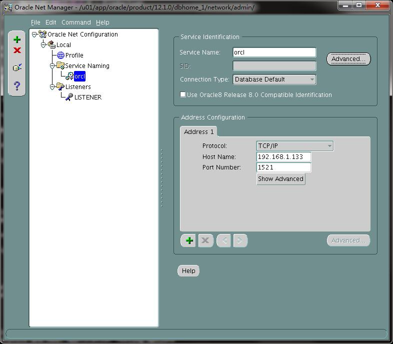

# 安装oracle12c记录

12c（linuxamd64_12102_database_se2）。

参考系统：

```shell
[root@centos7 ~]# hostnamectl
   Static hostname: centos7.example.com
         Icon name: computer
           Chassis: n/a
        Machine ID: 583b4d69eaea465ea4bb96ac3b891e15
           Boot ID: 931ed1af622046ebbde071a87844a7d5
    Virtualization: kvm
  Operating System: CentOS Linux 7 (Core)
       CPE OS Name: cpe:/o:centos:centos:7
            Kernel: Linux 3.10.0-229.11.1.el7.x86_64
      Architecture: x86_64
```

## 先决条件

成功安装操作系统后，请确认主机名称并在你的 DNS 上登记它。你也可选择在 **/etc/hosts** 内加入你的 `IP    主机名`。

```
[root@centos7 ~]# cat /etc/hostname
centos7.example.com
```

将 SELinux 维持在 enforcing 模式，并启用防火墙

```
[root@centos7 ~]# sestatus
SELinux status:                 enabled
SELinuxfs mount:                /sys/fs/selinux
SELinux root directory:         /etc/selinux
Loaded policy name:             targeted
Current mode:                   enforcing
Mode from config file:          enforcing
Policy MLS status:              enabled
Policy deny_unknown status:     allowed
Max kernel policy version:      28
```

```
[root@centos7 ~]# firewall-cmd --state
running

```

把 CentOS 系统更新至最新组件

```
[root@centos7 ~]# yum update -y
```

下载 Oracle 数据库 12c 的 Linux x86-64 版本：

[http://www.oracle.com/technetwork/database/enterprise-edition/downloads/index.html](http://www.oracle.com/technetwork/database/enterprise-edition/downloads/index.html)


## 安装步骤

为 Oracle 数据库创建所须的操作系统用户及群组。

```
groupadd oinstall
groupadd dba
useradd -g oinstall -G dba oracle
passwd oracle
```

在 */etc/sysctl.conf* 加入下列内核参数

```
fs.aio-max-nr = 1048576
fs.file-max = 6815744
kernel.shmall = 2097152
kernel.shmmax = 1987522560
kernel.shmmni = 4096
kernel.sem = 250 32000 100 128
net.ipv4.ip_local_port_range = 9000 65500
net.core.rmem_default = 262144
net.core.rmem_max = 4194304
net.core.wmem_default = 262144
net.core.wmem_max = 1048586
```

检查并运用新的数值。

```
sysctl -p
sysctl -a
```

在 */etc/security/limits.conf* 为 oracle 用户设置上限

```
oracle soft nproc 2047
oracle hard nproc 16384
oracle soft nofile 1024
oracle hard nofile 65536
oracle soft stack 10240
oracle soft stack 32768
```

将 Oracle 数据库软件的 zip 文件（linuxamd64_12102_database_1of2.zip, linuxamd64_12102_database_2of2.zip）解压至 */stage* 目录。

```
mkdir /stage
yum install -y zip unzip
unzip linuxamd64_12102_database_se2_1of2.zip -d /stage/
unzip linuxamd64_12102_database_se2_2of2.zip -d /stage/
```

修改　*/stage* 的权限

```
chown -R oracle:oinstall /stage/
```

为 Oracle 软件创建 */u01* 目录，及为数据库文件创建 */u02* 目录。

```
mkdir /u01
mkdir /u02
chown -R oracle:oinstall /u01
chown -R oracle:oinstall /u02
chmod -R 775 /u01
chmod -R 775 /u02
chmod g+s /u01
chmod g+s /u02
```

安装所须组件：

```
yum install -y binutils.x86_64 compat-libcap1.x86_64 gcc.x86_64 gcc-c++.x86_64 glibc.i686 glibc.x86_64 \
glibc-devel.i686 glibc-devel.x86_64 ksh compat-libstdc++-33 libaio.i686 libaio.x86_64 libaio-devel.i686 libaio-devel.x86_64 \
libgcc.i686 libgcc.x86_64 libstdc++.i686 libstdc++.x86_64 libstdc++-devel.i686 libstdc++-devel.x86_64 libXi.i686 libXi.x86_64 \
libXtst.i686 libXtst.x86_64 make.x86_64 sysstat.x86_64 smartmontools.x86_64 nfs-utils

```

还有安装 *X Window System* 组件群组。

```
yum groupinstall -y "X Window System"

```

由于 Oracle 的安装采用图像界面，你可通过以下三个简单的方法进行。

- 方案 1

  通过 SSH 从一台图像化 Linux 计算机远程登录。

  ```
  ssh -X oracle@centos7.example.com
  ```

- 方案 2 

  利用一台拥有 SSH 客户端（PuTTY）及 X-Windows 终端機仿真器（Xming）的微软 Windows 桌面。

  以下文档描述如何在 Windows 系统上安装 Xming。

  [Xming —— 微软 Windows 计算机下的 X-Windows 终端機仿真器](https://wiki.centos.org/zh/HowTos/Xming)

  请采用上述的方案登录为 oracle 用户，然后执行 Oracle 安装程序：

  ```
  [oracle@centos7 ~]$ /stage/database/runInstaller
  Starting Oracle Universal Installer...
  ```

- 方案3

  请安装xshell + xmanager

  在xshell连接--属性--SSH--隧道中，勾选转发X11连接到xmanager
  
  **打开xmanager，在属性中把需要连接的IP填到受信主机列表中。**


请采用上述的方案登录为 oracle 用户，然后执行 Oracle 安装程序：

```
[oracle@centos7 ~]$ export DISPLAY=192.168.1.85:0.0
[oracle@centos7 ~]$ /stage/database/runInstaller
Starting Oracle Universal Installer...
```
## Oracle 安装程序画面

`第一步 安全性更新`

假若你不想接收来自 Oracle 支持部的电邮，请取消勾选该项目并按 **Next**。

在新打开的窗口按 YES。

`第二步 安装选项`

选择 **Create and configure a database** 并按 **Next**

`第三步 系统级别`

选择 **Desktop Class** 进行缺省的简便 Oracle 数据库安装。

`第四步 典型安装`

在 Typical Install Configuration 画面，设置以下功能。

| 参数                   | 值                                      |
| ---------------------- | --------------------------------------- |
| Oracle base            | /u01/app/oracle                         |
| Software location      | /u01/app/oracle/product/12.1.0/dbhome_1 |
| Database file location | /u02                                    |
| Global database name   | orcl.example.com                        |

另外请设置合适的 **Database edition（数据库版本）**及 **Character set（符集）**。请为数据库的管理订立一个安全的**口令**，最后请取消勾选 **Create as Container database** 项目。

`第五步 创建库存`

接纳缺省的 **/u01/app/oraInventory** 并按 **Next**。

`第六步 检查先决条件`

安装程序会自动检查所有必须的操作系统组件及内核设置。

`第七部 摘要`

这是编辑安装特点的最后机会。请按 **Install**。

 `第八步 执行设置脚本`

当询问窗口出现时，请登录成为 root 并执行两个脚本：

```
[root@centos7 ~]# /u01/app/oraInventory/orainstRoot.sh
Changing permissions of /u01/app/oraInventory.
Adding read,write permissions for group.
Removing read,write,execute permissions for world.
Changing groupname of /u01/app/oraInventory to oinstall.
The execution of the script is complete.
```

```
[root@centos7 ~]# /u01/app/oracle/product/12.1.0/dbhome_1/root.sh
Performing root user operation.
The following environment variables are set as:
    ORACLE_OWNER= oracle
    ORACLE_HOME=  /u01/app/oracle/product/12.1.0/dbhome_1
Enter the full pathname of the local bin directory: [/usr/local/bin]: <PRESS ENTER>
   Copying dbhome to /usr/local/bin ...
   Copying oraenv to /usr/local/bin ...
   Copying coraenv to /usr/local/bin ...
Creating /etc/oratab file...
Entries will be added to the /etc/oratab file as needed by
Database Configuration Assistant when a database is created
Finished running generic part of root script.
Now product-specific root actions will be performed.
You can follow the installation in a separated window.

```

这两个脚本都必须以 root 的身份来执行。

`第九步 安装进度`

一个显示安装进度的窗口将会出现。请勿关闭这个窗口。

`第十步 顺利完成安装`

最后一个画面将会通知你安装已经完成并显示 Oracle 企业级管理员的 URL。

[https://localhost:5500/em](https://localhost:5500/em)

请按 OK 来关闭安装程序。


## 安装后的任务

### 防火墙

请登录成为 root 并检查已引导的本地

```
[root@centos7 ~]# firewall-cmd --get-active-zones
public
  interfaces: eth0

```

打开相关的端口

```
[root@centos7 ~]# firewall-cmd --zone=public --add-port=1521/tcp --add-port=5500/tcp --add-port=5520/tcp --add-port=3938/tcp --permanent
success

```

```
[root@centos7 ~]# firewall-cmd --reload
success

```

```
[root@centos7 ~]# firewall-cmd --list-ports
1521/tcp 3938/tcp 5500/tcp 5520/tcp

```

### Oracle 工作环境

请登录为 oracle 用户并在 */home/oracle/.bash_profile* 内加入下列数值

```
TMPDIR=$TMP; export TMPDIR
ORACLE_BASE=/u01/app/oracle; export ORACLE_BASE
ORACLE_HOME=$ORACLE_BASE/product/12.1.0/dbhome_1; export ORACLE_HOME
ORACLE_SID=orcl; export ORACLE_SID
PATH=$ORACLE_HOME/bin:$PATH; export PATH
LD_LIBRARY_PATH=$ORACLE_HOME/lib:/lib:/usr/lib:/usr/lib64; export LD_LIBRARY_PATH
CLASSPATH=$ORACLE_HOME/jlib:$ORACLE_HOME/rdbms/jlib; export CLASSPATH

```

重新装入 bash_profile 来运用新设置值：

```
[oracle@centos7 ~]$ . .bash_profile

```

### 登录数据库

最后请登录数据库：

```
[oracle@centos7 ~]$ sqlplus system@orcl
... output omitted ...
Oracle Database 12c Enterprise Edition Release 12.1.0.2.0 - 64bit Production
With the Partitioning, OLAP, Advanced Analytics and Real Application Testing options
SQL>
```

请利用 Oracle 企业级管理员来管理数据库：

`https://<主机名称>:5500/em`

### 远程登录数据库

```
[oracle@centos7 ~]$ cd $ORACLE_HOME/network/admin
[oracle@centos7 ~]$ vim listener.ora

LISTENER =
  (DESCRIPTION_LIST =
    (DESCRIPTION =
      (ADDRESS = (PROTOCOL = TCP)(HOST = IP or Hostname)(PORT = 1521))
      (ADDRESS = (PROTOCOL = IPC)(KEY = EXTPROC1521))
    )
  )
  
SID_LIST_LISTENER =
  (SID_LIST =
    (SID_DESC =
      (ORACLE_HOME =/u01/app/oracle/product/12.1.0/dbhome_1)
      (SID_NAME = orcl121)
     )
  )
```
执行：
```
[oracle@localhost admin]$ lsnrctl stop
[oracle@localhost admin]$ lsnrctl start
[oracle@localhost admin]$ lsnrctl status

LSNRCTL for Linux: Version 12.1.0.2.0 - Production on 09-OCT-2017 03:12:44

Copyright (c) 1991, 2014, Oracle.  All rights reserved.

Connecting to (DESCRIPTION=(ADDRESS=(PROTOCOL=TCP)(HOST=192.168.1.92)(PORT=1521)))
STATUS of the LISTENER
------------------------
Alias                     LISTENER
Version                   TNSLSNR for Linux: Version 12.1.0.2.0 - Production
Start Date                09-OCT-2017 03:11:33
Uptime                    0 days 0 hr. 1 min. 10 sec
Trace Level               off
Security                  ON: Local OS Authentication
SNMP                      OFF
Listener Parameter File   /u01/app/oracle/product/12.1.0/dbhome_1/network/admin/listener.ora
Listener Log File         /u01/app/oracle/diag/tnslsnr/localhost/listener/alert/log.xml
Listening Endpoints Summary...
  (DESCRIPTION=(ADDRESS=(PROTOCOL=tcp)(HOST=192.168.1.92)(PORT=1521)))
  (DESCRIPTION=(ADDRESS=(PROTOCOL=ipc)(KEY=LISTENER)))
  (DESCRIPTION=(ADDRESS=(PROTOCOL=tcp)(HOST=127.0.0.1)(PORT=1521)))
  (DESCRIPTION=(ADDRESS=(PROTOCOL=tcps)(HOST=localhost)(PORT=5500))(Security=(my_wallet_directory=/u01/app/oracle/product/12.1.0/dbhome_1/admin/orcl121/xdb_wallet))(Presentation=HTTP)(Session=RAW))
Services Summary...
Service "orcl121" has 1 instance(s).
  Instance "orcl121", status READY, has 1 handler(s) for this service...
Service "orcl121XDB" has 1 instance(s).
  Instance "orcl121", status READY, has 1 handler(s) for this service...
The command completed successfully
```


```
create user "JACKGO" identified by ******* profile "DEFAULT" account unlock default tablespace  "USERS" temporary tablespace "TEMP";
        
grant "DBA" to "JACKGO";
grant CREATE USER to "JACKGO";
grant "RESOURCE" to "JACKGO";
grant CREATE ANY TABLE to "JACKGO";
grant CREATE ANY VIEW to "JACKGO";
grant DROP USER to "JACKGO";
grant "CONNECT" to "JACKGO";
grant ALTER USER to "JACKGO";
```


 strace sqlplus -L scott/tiger@orcl 2>&1| grep -i 'open.*tnsnames.ora'

### 图形化网络配置

netmgr 或 netca

netmgr功能更全面，切记配SID的时候listener中是区分大小写的！

 