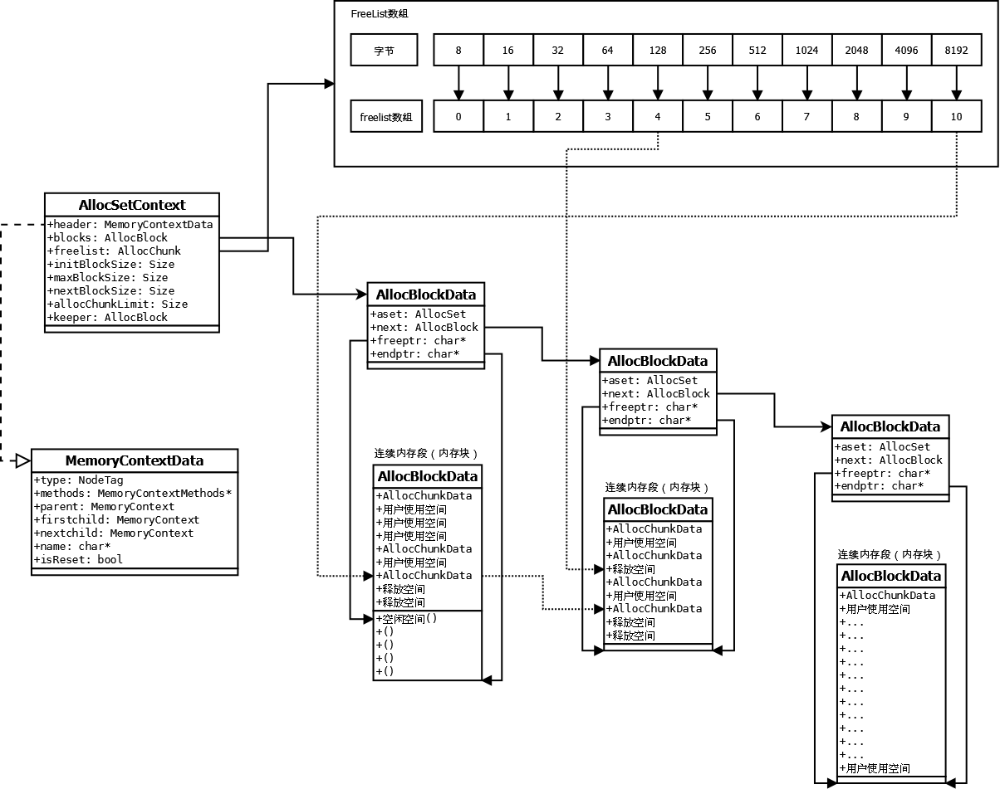
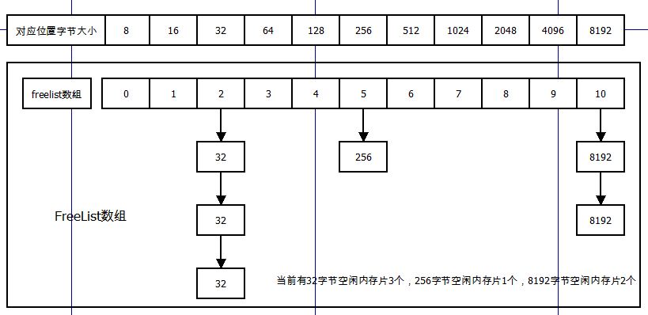
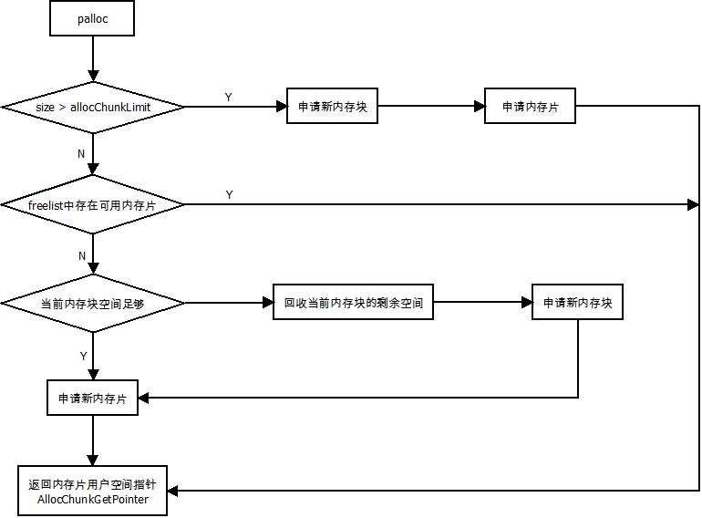
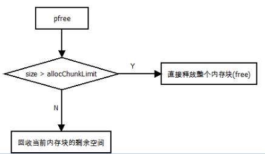
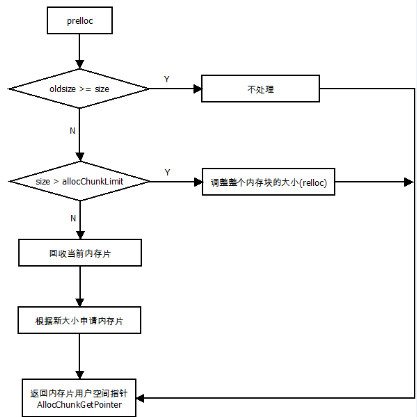

# MemoryContext分析

> 高铭杰
>
> 2016年6月
>
> jackgo73@outlook.com


### 1 数据库内存上下文

　　postgresql在7.1版本引入了内存上下文机制来解决日益严重的内存泄漏的问题，在引入了这种“内存池”机制后，数据库中的内存分配改为在“内存上下文中”进行，对用户来说，对内存的申请由原来的malloc、free变成了palloc、pfree。对内存上下文的常用操作包括：

>- 创建一个内存上下文：MemoryContextCreate
>- 在上下文中分配内存片：palloc
>- 删除内存上下文：MemoryContextDelete
>- 重置内存上下文：MemoryContextReset

这里引入两个概念：**内存片**和**内存块**的概念。
  > **内存片(CHUNK)**：用户在内存上下文中申请(palloc)到的内存单位。
  > **内存块(BLOCK)**：内存上下文在内存中申请(malloc)到的内存单位。

### 2 数据结构
#### 2.1 AllocSetContext
```c
typedef struct AllocSetContext
{
	MemoryContextData header;	/* Standard memory-context fields */
	/* Info about storage allocated in this context: */
	AllocBlock	blocks;			/* head of list of blocks in this set */
	AllocChunk	freelist[ALLOCSET_NUM_FREELISTS];		/* free chunk lists */
	/* Allocation parameters for this context: */
	Size		initBlockSize;	/* initial block size */
	Size		maxBlockSize;	/* maximum block size */
	Size		nextBlockSize;	/* next block size to allocate */
	Size		allocChunkLimit;	/* effective chunk size limit */
	AllocBlock	keeper;			/* if not NULL, keep this block over resets */
} AllocSetContext;
```
　　AllocSetContext是内存上下文的核心的控制结构，我们在代码中经常看到的内存上下文TopMemoryContext的定义为：
```c
MemoryContext TopMemoryContext = NULL;
```
 　　可以看到这个内存上下文的类型是MemoryContext，即：
```
typedef struct MemoryContextData
{
	NodeTag		type;			/* identifies exact kind of context */
	MemoryContextMethods *methods;		/* virtual function table */
	MemoryContext parent;		/* NULL if no parent (toplevel context) */
	MemoryContext firstchild;	/* head of linked list of children */
	MemoryContext nextchild;	/* next child of same parent */
	char	   *name;			/* context name (just for debugging) */
	bool		isReset;		/* T = no space alloced since last reset */
} MemoryContextData;
```
　　那么MemoryContextData和AllocSetContext是什么样的关系呢？请看下图左半部分。
　　
　　　　　　　　　　　　　　　　图 2-1 内存上下文数据结构
　　　　　　　　　　　　　　　　
　　AllocSetContext结构的第一个指针用于指向MemoryContextData，也就是说TopMemoryContext实际上是一个AllocSetContext结构，但是使用时通常将类型转换为MemoryContextData，实际上这也是PG中最常用的技巧之一，在代码中可以看到这样的写法：
```
AllocSet	set = (AllocSet) context;
```
　　由于AllocSetContext结构中的首部存放着MemoryContextData指针，所以这种转换可以成功。这样的使用方法有些类似与类的继承：MemoryContextData代表父类，AllocSetContext在父类（头部的指针）的基础上增加了一些新的功能。实际上PG就是使用了这种机制实现了interface（MemoryContextData作为interface），而后面的实现可以有很多种（AllocSetContext是内存上下文的一种实现）。
　　好说到这里言归正传，继续介绍MemoryContextData数据结构的功能：

>- methods：保存着内存上下文操作的函数指针（例如palloc、pfree）
> - parent、firstchild、nextchild：形成内存上下文的BTree结构
> - name：内存上下文名称（为了调试而存在）
> - isReset：记录上次重置后是否有内存申请动作发生


　　MemoryContextData使内存上下文形成了一个二叉树的结构，这样的数据结构增加了内存上下文的易用性，即在重置或删除内存上下文时，所有当前上下文的子节点也会被递归的删除或重置，避免错删或漏删上下文。methods中保存的全部为函数指针，在内存上下文创建时，这些指针会被赋予具体函数地址。
　　下面继续介绍AllocSetContext数据结构：

> - header：前面介绍过了
> - blocks：内存块链表，内存上下文向OS申请连续大块内存后，空间由blocks链表维护
> - freelist：内存片回收数组，后面具体分析
> - initBlockSize：上下文申请的第一个内存块的大小
> - maxBlockSize： 上下文申请的最大的内存块的大小
> - nextBlockSize： 上下文下一次申请的内存块的大小（MemoryContextCreate函数中介绍这三个参数）
> - **allocChunkLimit**：申请内存片/块的阈值
> - keeper：这个指针指向内存上下文重置时不释放的内存块

#### 2.2 AllocChunkData
　　内存片存在于内存块以内，是内存块分割后形成的一段空间，内存片空间的头部为AllocChunkData结构体，后面跟着该内存片的空间，实际上palloc返回的就这指向这段空间首地址的指针。内存片有两种状态：AllocSetContext中freelist数组中存放的是内存片指针是被回收的内存片；另外一种内存片是用户正在使用的内存片。（注意两种状态的内存片都存在于内存块中，被回收只是改变内存片aset指针，形成链表保存在freelist中；在使用中的内存片aset指针指向所属的AllocSetContext）
```
typedef struct AllocChunkData
{
	void	   *aset;
	Size		size;
}	AllocChunkData;
```

　　在palloc时会发生两种情况：

 >- allocset会在自己维护的内存块链表（blocks）中寻找空间构造内存片，然后分配给用户。
 >- 申请新的内存块追加到blocks链表中，在其中分配新的内存片分配给用户。


　　内存片的数据结构相对简单，空指针aset是一个复用的指针，当内存片正在使用时，aset指向它属于的allocset结构，当内存片被释放后，内存片被freelist数组回收，aset作为实现链表的指针，用于形成内存片的链式结构。

#### 2.3 AllocBlockData
```
typedef struct AllocBlockData
{
	AllocSet	aset;			/* aset that owns this block */
	AllocBlock	next;			/* next block in aset's blocks list */
	char	   *freeptr;		/* start of free space in this block */
	char	   *endptr;			/* end of space in this block */
}	AllocBlockData;
```
　　内存块是内存上下文向操作系统申请的连续的一块内存空间，申请后将AllocBlockData结构置于空间的首部，其中freeptr和endptr用与指向当前内存块中空闲空间的首地址和当前内存块的尾地址，见图2-1中的“连续内存段（内存块）”。aset指向控制结构AllocSetContext，next指针形成内存块的链式结构。


#### 2.4 freelist[ALLOCSET_NUM_FREELISTS]
　　AllocSetContext结构中的一个重要的数组freelist，这是一个定长数组：
```
#define ALLOCSET_NUM_FREELISTS	11
.
.
AllocChunk	freelist[ALLOCSET_NUM_FREELISTS];		/* free chunk lists */
.
.
```
　　这是一个存放内存片指针的数组，数组中每一个元素都是一个内存片指针，就像前面提到的，空闲内存片会形成链表结构，而链表的头结点的指针就存放在这个数组中。从长度来看，这个数组可以保存11个内存片的链表，每一个链表都保存这特定大小的内存片：

　　　　　　　　　　　　　图2-2 freelist

　　图2-2描述的就是freelist数组的结构，数组下标0位置保存8字节的内存片，下标1位置保存16字节的内存片，以此类推，freelist中可以保存的最大的内存片为8k字节。
　　相同大小的内存片会串在同一个链表中，放在freelist中指定的位置，数组下标的计算按照公式：log(Size)-3。例如大小为512字节的内存片被释放了，套用公式log(512)-3=5，那么这个内存片就会维护到freelist[5]指向的链表中。（具体计算过程见AllocSetFreeIndex函数）。

### 3 算法
#### 3.1 AllocSetContextCreate：创建内存上下文
```
MemoryContext
AllocSetContextCreate(MemoryContext parent,
					  const char *name,
					  Size minContextSize,
					  Size initBlockSize,
					  Size maxBlockSize)
```

内存上下文创建需要传入几个参数：

>- parent：当前创建内存上下文的父节点
>- name：当前创建内存上下文名称
>- minContextSize：创建上下文时申请内存块大小
>- initBlockSize：该上下文第一次申请内存块大小
>- maxBlockSize：该上下文可以申请的最大内存块大小

让我们看几个数据库中最常见的上下文创建时的参数，结合具体值在说说创建时参数的作用：


> - **minContextSize**：如果这个值设定了并超过了一定大小（一个内存块结构体加上一个内存片结构体的大小），那么在创建上下文时立即申请一个内存块，大小为minContextSize。上图中我们可以看到大部分上下文minContextSize都为0，那么ErrorContext的minContextSize为8k有什么作用呢？在系统出现OOM时，内存空间已经耗尽，但是ereport的错误处理流程仍然需要申请内存空间去打印错误信息，但系统已经没有内存可以申请了。这时ErrorContext中保留的8k空间可以保证最后的错误处理流程可以正确执行。
>
> -**initBlockSize**、**maxBlockSize**：内存上下文中的内存块申请的大小是由这两个参数决定的，initBlockSize代表了第一次申请的内存块大小，后面每一次申请都是前一次申请大小的二倍，直到申请内存大小为maxBlockSize为止，当达到maxBlockSize时，以后每一次申请的内存大小都等于maxBlockSize。（事实上如果多次在一个上下文申请内存，那么很快就会到达maxBlockSize，举个例子：TupleSort中申请内存块的大小序列为：8k  16k  32k  64k  128k  256k  512k  1M  2M  4M  8M  8M  8M  8M . . .）
> 　
> - **allocChunkLimit**：这里引出一个重要的参数，**内存片申请阈值**，这个值被开始被设为8k字节，但是后面会适当缩小到maxBlockSize的1/8。这个参数的调整是为了减少内存片空间的浪费（内存块中的最后一段内存不足以放下一个内存片，所以这段空间被舍弃掉了，理论上浪费掉的空间最大为allocChunkLimit）

#### 3.2 AllocSetAlloc

申请内存的流程图：



需要重点关注的有几点：

 - 回收当前内存块的剩余空间：将剩余空间切割成freelist能保存的最大值，例如1000字节的内存片回收时首先申请512字节的内存片，然后挂在freelist[6]上，剩余488字节申请256字节的内存片挂在freelist[5]上，剩余232字节继续上面处理流程，直到最后空间小于8字节为止。
 - 在多次申请内存块后，内存块的大小总会等于maxBlockSize，这样如果出现内存泄漏导致OOM时，如果某一个内存上下文非常大，可以利用这个特点分析内存问题的根因。例如每100次申请8M的内存块时，打印一次Backtrace。


#### 3.3 AllocSetFree

释放内存流程图：



#### 3.4 AllocSetRealloc

relloc流程图：




#### 3.5 AllocSetStats 
这个函数会被MemoryContextStats递归调用，遍历内存上下文树的内个节点，并获取当前节点的信息。

GDB调试时这一个非常好用的函数，可以直接在log中打印内存上下文树，指令：
```
gdb > p MemoryContextStats(TopMemoryContext)
```

PG提供了一系列内存上下文debug相关函数，具体可见mcxt.c


