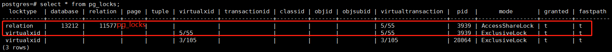
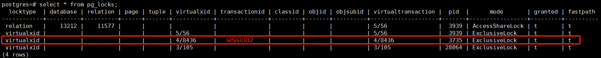
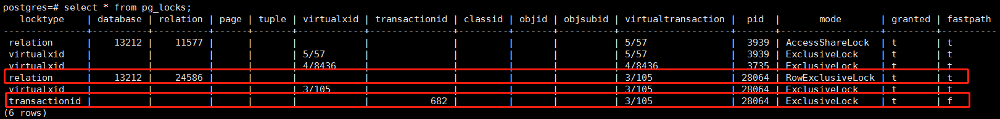
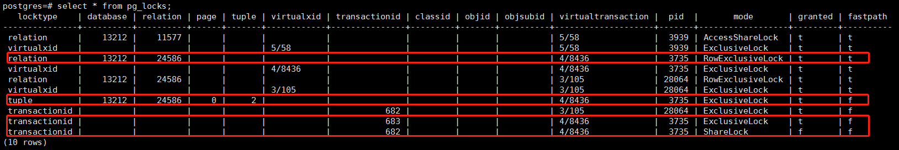
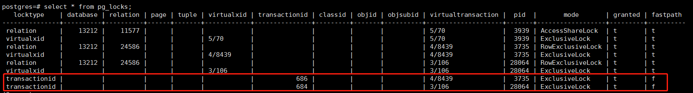
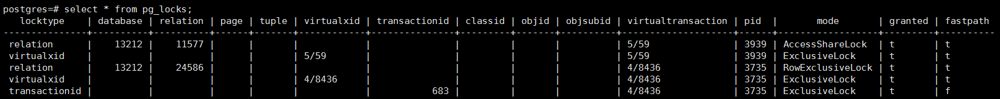
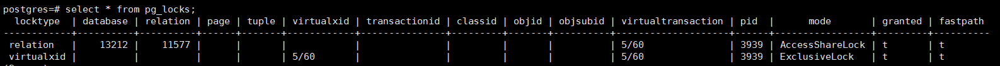

# Postgresql并发控制总结实践

## 背景

之前客户问过在不同隔离级别下，事务并发会产生什么效果，这里从事务的现象、锁表状态等角度分析不同隔离级别下，读读、读写、写写数据冲突的效果。

尽量总结全，以后客户问就不用再做实验了。

## 基础概念（手册）

### 介绍

PostgreSQL为开发者提供了一组丰富的工具来管理对数据的并发访问。

在内部，数据一致性通过使用一种多版本模型（多版本并发控制，MVCC）来维护。这就意味着每个 SQL 语句看到的都只是一小段时间之前的数据快照（一个数据库版本），而不管底层数据的当前状态。这样可以保护语句不会看到可能由其他在相同数据行上执行更新的并发事务造成的不一致数据，为每一个数据库会话提供事务隔离。

MVCC避免了传统的数据库系统的锁定方法，将锁争夺最小化来允许多用户环境中的合理性能。使用MVCC并发控制模型而不是锁定的主要优点是在MVCC中，对查询（读）数据的锁请求与写数据的锁请求不冲突，所以读不会阻塞写，而写也从不阻塞读。甚至在通过使用革新的可序列化快照隔离（SSI）级别提供最严格的事务隔离级别时，PostgreSQL也维持这个保证。

在PostgreSQL里也有表和行级别的锁功能，用于那些通常不需要完整事务隔离并且想要显式管理特定冲突点的应用。不过，恰当地使用MVCC通常会提供比锁更好的性能。另外，由应用定义的咨询锁提供了一个获得不依赖于单一事务的锁的机制。 

### 事务隔离 

SQL标准定义了四种隔离级别。最严格的是可序列化，在标准中用了一整段来定义它，其中说到一组可序列化事务的任意并发执行被保证效果和以某种顺序一个一个执行这些事务一样。其他三种级别使用并发事务之间交互产生的现象来定义，每一个级别中都要求必须不出现一种现象。注意由于可序列化的定义，在该级别上这些现象都不可能发生（这并不令人惊讶--如果事务的效果与每个时刻只运行一个的相同，你怎么可能看见由于交互产生的现象？） 

在各个级别上被禁止出现的现象是：

- 脏读

  一个事务读取了另一个并行未提交事务写入的数据。

- 不可重复读

  一个事务重新读取之前读取过的数据，发现该数据已经被另一个事务（在初始读之后提交）修改。

- 幻读

  一个事务重新执行一个返回符合一个搜索条件的行集合的查询， 发现满足条件的行集合因为另一个最近提交的事务而发生了改变。

- 序列化异常

  成功提交一组事务的结果与这些事务所有可能的串行执行结果都不一致。

SQL 标准和 PostgreSQL 实现的事务隔离级别在 Table 13-1中描述。 

| 隔离级别 | 脏读         | 不可重复读 | 幻读         | 序列化异常 |
| ---- | ---------- | ----- | ---------- | ----- |
| 读未提交 | 允许，但不在PG 中 | 可能    | 可能         | 可能    |
| 读已提交 | 不可能        | 可能    | 可能         | 可能    |
| 可重复读 | 不可能        | 不可能   | 允许，但不在PG 中 | 可能    |
| 可序列化 | 不可能        | 不可能   | 不可能        | 不可能   |

- 在PostgreSQL中，你可以请求四种标准事务隔离级别中的任意一种，但是内部只实现了三种不同的隔离级别，即 PostgreSQL 的读未提交模式的行为和读已提交相同。这是因为把标准隔离级别映射到 PostgreSQL 的多版本并发控制架构的唯一合理的方法。
- 该表格也显示 PostgreSQL 的可重复读实现不允许幻读。而 SQL 标准允许更严格的行为：四种隔离级别只定义了哪种现像不能发生，但是没有定义哪种现像必须发生。可用的隔离级别的行为在下面的小节中详细描述。
- 要设置一个事务的事务隔离级别，使用SET TRANSACTION命令。


锁表

| Requested Lock Mode    | ACCESS SHARE | ROW SHARE | ROW EXCLUSIVE | SHARE UPDATE EXCLUSIVE | SHARE | SHARE ROW EXCLUSIVE | EXCLUSIVE | ACCESS EXCLUSIVE |
| ---------------------- | ------------ | --------- | ------------- | ---------------------- | ----- | ------------------- | --------- | ---------------- |
| ACCESS SHARE           |              |           |               |                        |       |                     |           | X                |
| ROW SHARE              |              |           |               |                        |       |                     | X         | X                |
| ROW EXCLUSIVE          |              |           |               |                        | X     | X                   | X         | X                |
| SHARE UPDATE EXCLUSIVE |              |           |               | X                      | X     | X                   | X         | X                |
| SHARE                  |              |           | X             | X                      |       | X                   | X         | X                |
| SHARE ROW EXCLUSIVE    |              |           | X             | X                      | X     | X                   | X         | X                |
| EXCLUSIVE              |              | X         | X             | X                      | X     | X                   | X         | X                |
| ACCESS EXCLUSIVE       | X            | X         | X             | X                      | X     | X                   | X         | X                |

测试数据

```sql
create table t1 (i int);
insert into t1 select generate_series(1,10);

postgres=# select * from t1;
 i  
----
  1
  2
  3
  4
  5
  6
  7
  8
  9
 10
(10 rows)
```


## 读已提交隔离级别 

### 读写冲突

脏读 >>> 不会发生

幻读、不可重复读 >>> 发生了...

```sql
begin;                                           begin;
select * from t1 where i = 1;                    
 i                                               
---
 1
(1 row)

                                                 update t1 set i=10 where i=1;
                                                 UPDATE 1
                                                 
select * from t1 where i = 1;
 i 
---
 1
(1 row)

                                                  commit;
                                                  
postgres=# select * from t1 where i = 1;
 i 
---
(0 rows)
```

MVCC保证了读、写不阻塞，所以这里不涉及锁。

### 写写冲突

**[session1]事务号682**

**[session2]事务号683**


**[session1]**启动事务

```sql
begin;
```



**[session2]**启动事务

```sql
begin;
```



**[session1]**更新数据

```sql
update t1 set i=20 where i=2;
UPDATE 1
```



- 更新数据后会在表上挂ROW EXCLUSIVE —— 3级锁。
- 在s1的事务号上挂一把EXCLUSIVE 锁。


**[session2]**更新同一条数据

```sql
postgres=# update t1 set i=20 where i=2;
-- 阻塞
```



- s2在表上也挂了一把ROW EXCLUSIVE —— 3级锁。（3级锁是相容的，所以表上挂的锁没问题）
- 在操作元组上面挂了一把EXCLUSIVE锁，这里已经获取到了。
- 在自己的s2的事务号683上面加了一把EXCLUSIVE锁，获取到了。
- 在s1的事务号682要加一把sharelock，这里与682事务的EXCLUSIVE冲突，所以阻塞在这里。

---

**>>>>初步结论<<<<**

写操作的事务，会在自己的事务号上面加一个排它锁。那更新不同的元组也会阻塞吗？

见下图，两个事务分别更新了同一张标的两行：



注意这里面没有发生阻塞等锁，每个事务都在自己的事务号上面加了一把排他锁。

所以如果事务二的写元组是 事务一写过的元组，那么事务二会尝试在事务一的事务号上加锁。

如果事务二写的元组不是事务一写过的元组，那么事务二会用自己的事务号加锁。

（更新多条也只在事务ID上加一次锁）

**>>>>结论<<<<**

多个事务更新同一条数据，会用自己的事务号来互斥保证时间戳的规则要求。

---


**[session1]**提交

```sql
--s1
commit;
COMMIT

--s2
update t1 set i=20 where i=2;
UPDATE 0
```




**[session2]**提交

```sql
--s2
commit;
COMMIT
```



