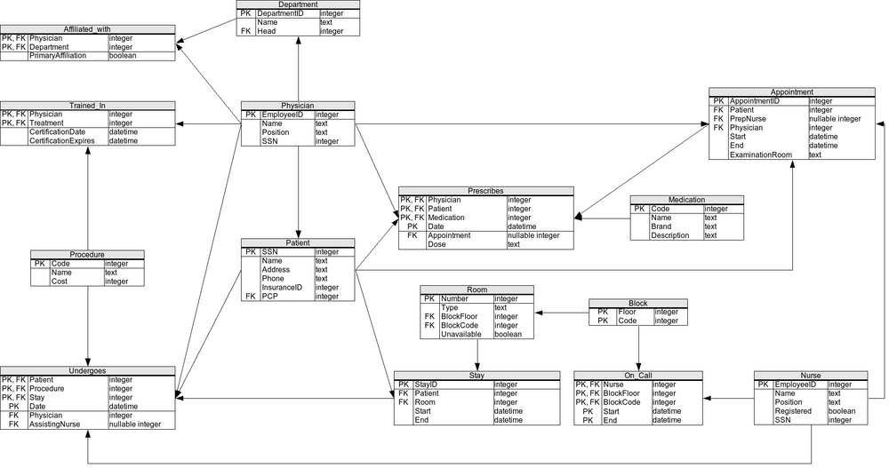

# The Hospital案例——执行计划&成本分析（未完）

gaomingjie

2018-05-02

https://en.wikibooks.org/wiki/SQL_Exercises/The_Hospital



## 背景

在The Hospital案例中，尝试做几种SQL执行计划的分析和成本计算。

PostgreSQL 9.6.8相关参数：

```
#seq_page_cost = 1.0                    # measured on an arbitrary scale
#random_page_cost = 4.0                 # same scale as above
#cpu_tuple_cost = 0.01                  # same scale as above
#cpu_index_tuple_cost = 0.005           # same scale as above
#cpu_operator_cost = 0.0025             # same scale as above
#parallel_tuple_cost = 0.1              # same scale as above
#parallel_setup_cost = 1000.0   # same scale as above
#min_parallel_relation_size = 8MB
#effective_cache_size = 4GB
```

## 构造数据

```sql
create table physician ( 
  employeeid int primary key, 
  name text not null, 
  position text not null, 
  ssn int not null
);
create table department ( 
  departmentid int primary key,
  name text not null, 
  head int not null constraint fk_physician_employeeid references physician(employeeid)
);
CREATE TABLE Affiliated_With ( 
  physician int  constraint fk_physician_employeeid references physician(employeeid), 
  department int constraint fk_department_departmentid references department(departmentid), 
  PrimaryAffiliation BOOL NOT NULL, 
  primary key(physician, department)
);
CREATE TABLE Procedure (
  Code INTEGER PRIMARY KEY NOT NULL,
  Name TEXT NOT NULL,
  Cost REAL NOT NULL
);
CREATE TABLE Trained_In (
  Physician INTEGER CONSTRAINT fk_Physician_EmployeeID REFERENCES Physician(EmployeeID),
  Treatment INTEGER CONSTRAINT fk_Procedure_Code REFERENCES Procedure(Code),
  CertificationDate date NOT NULL,
  CertificationExpires date NOT NULL,
  PRIMARY KEY(Physician, Treatment)
);
CREATE TABLE Patient (
  SSN INTEGER PRIMARY KEY,
  Name TEXT NOT NULL,
  Address TEXT NOT NULL,
  Phone TEXT NOT NULL,
  InsuranceID INTEGER NOT NULL,
  PCP INTEGER NOT NULL CONSTRAINT fk_Physician_EmployeeID REFERENCES Physician(EmployeeID)
);
CREATE TABLE Nurse (
  EmployeeID INTEGER PRIMARY KEY NOT NULL,
  Name TEXT NOT NULL,
  Position TEXT NOT NULL,
  Registered BOOLEAN NOT NULL,
  SSN INTEGER NOT NULL
);
CREATE TABLE Appointment (
  AppointmentID INTEGER PRIMARY KEY,
  Patient INTEGER NOT NULL CONSTRAINT fk_Patient_SSN REFERENCES Patient(SSN),
  PrepNurse INTEGER CONSTRAINT fk_Nurse_EmployeeID REFERENCES Nurse(EmployeeID),
  Physician INTEGER NOT NULL CONSTRAINT fk_Physician_EmployeeID REFERENCES Physician(EmployeeID),
  Start DATE NOT NULL,
  End_ DATE NOT NULL,
  ExaminationRoom TEXT NOT NULL
);
CREATE TABLE Medication (
  Code INTEGER PRIMARY KEY NOT NULL,
  Name TEXT NOT NULL,
  Brand TEXT NOT NULL,
  Description TEXT NOT NULL
);
CREATE TABLE Prescribes (
  Physician INTEGER CONSTRAINT fk_Physician_EmployeeID REFERENCES Physician(EmployeeID),
  Patient INTEGER CONSTRAINT fk_Patient_SSN REFERENCES Patient(SSN),
  Medication INTEGER CONSTRAINT fk_Medication_Code REFERENCES Medication(Code),
  Date DATE NOT NULL,
  Appointment INTEGER CONSTRAINT fk_Appointment_AppointmentID REFERENCES Appointment(AppointmentID),
  Dose TEXT NOT NULL,
  PRIMARY KEY(Physician, Patient, Medication, Date)
);
CREATE TABLE Block (
  Floor INTEGER NOT NULL,
  Code INTEGER NOT NULL,
  PRIMARY KEY(Floor, Code)
); 
CREATE TABLE Room (
  Number INTEGER PRIMARY KEY,
  Type TEXT NOT NULL,
  BlockFloor INTEGER NOT NULL,
  BlockCode INTEGER NOT NULL,
  Unavailable BOOLEAN NOT NULL
);
CREATE TABLE On_Call (
  Nurse INTEGER NOT NULL CONSTRAINT fk_Nurse_EmployeeID REFERENCES Nurse(EmployeeID),
  BlockFloor INTEGER NOT NULL,
  BlockCode INTEGER NOT NULL,
  Start DATE NOT NULL,
  End_ DATE NOT NULL,
  PRIMARY KEY(Nurse, BlockFloor, BlockCode, Start, End_)
);
CREATE TABLE Stay (
  StayID INTEGER PRIMARY KEY,
  Patient INTEGER NOT NULL CONSTRAINT fk_Patient_SSN REFERENCES Patient(SSN),
  Room INTEGER NOT NULL CONSTRAINT fk_Room_Number REFERENCES Room(Number),
  Start DATE NOT NULL,
  End_ DATE NOT NULL
);
CREATE TABLE Undergoes (
  Patient INTEGER NOT NULL CONSTRAINT fk_Patient_SSN REFERENCES Patient(SSN),
  Procedure INTEGER NOT NULL CONSTRAINT fk_Procedure_Code REFERENCES Procedure(Code),
  Stay INTEGER NOT NULL CONSTRAINT fk_Stay_StayID REFERENCES Stay(StayID),
  Date DATE NOT NULL,
  Physician INTEGER NOT NULL CONSTRAINT fk_Physician_EmployeeID REFERENCES Physician(EmployeeID),
  AssistingNurse INTEGER CONSTRAINT fk_Nurse_EmployeeID REFERENCES Nurse(EmployeeID),
  PRIMARY KEY(Patient, Procedure, Stay, Date)
);
```

```sql
INSERT INTO Physician VALUES(1,'John Dorian','Staff Internist',111111111);
INSERT INTO Physician VALUES(2,'Elliot Reid','Attending Physician',222222222);
INSERT INTO Physician VALUES(3,'Christopher Turk','Surgical Attending Physician',333333333);
INSERT INTO Physician VALUES(4,'Percival Cox','Senior Attending Physician',444444444);
INSERT INTO Physician VALUES(5,'Bob Kelso','Head Chief of Medicine',555555555);
INSERT INTO Physician VALUES(6,'Todd Quinlan','Surgical Attending Physician',666666666);
INSERT INTO Physician VALUES(7,'John Wen','Surgical Attending Physician',777777777);
INSERT INTO Physician VALUES(8,'Keith Dudemeister','MD Resident',888888888);
INSERT INTO Physician VALUES(9,'Molly Clock','Attending Psychiatrist',999999999);

INSERT INTO Department VALUES(1,'General Medicine',4);
INSERT INTO Department VALUES(2,'Surgery',7);
INSERT INTO Department VALUES(3,'Psychiatry',9);

INSERT INTO Affiliated_With VALUES(1,1,true);
INSERT INTO Affiliated_With VALUES(2,1,true);
INSERT INTO Affiliated_With VALUES(3,1,false);
INSERT INTO Affiliated_With VALUES(3,2,true);
INSERT INTO Affiliated_With VALUES(4,1,true);
INSERT INTO Affiliated_With VALUES(5,1,true);
INSERT INTO Affiliated_With VALUES(6,2,true);
INSERT INTO Affiliated_With VALUES(7,1,false);
INSERT INTO Affiliated_With VALUES(7,2,true);
INSERT INTO Affiliated_With VALUES(8,1,true);
INSERT INTO Affiliated_With VALUES(9,3,true);

INSERT INTO Procedure VALUES(1,'Reverse Rhinopodoplasty',1500.0);
INSERT INTO Procedure VALUES(2,'Obtuse Pyloric Recombobulation',3750.0);
INSERT INTO Procedure VALUES(3,'Folded Demiophtalmectomy',4500.0);
INSERT INTO Procedure VALUES(4,'Complete Walletectomy',10000.0);
INSERT INTO Procedure VALUES(5,'Obfuscated Dermogastrotomy',4899.0);
INSERT INTO Procedure VALUES(6,'Reversible Pancreomyoplasty',5600.0);
INSERT INTO Procedure VALUES(7,'Follicular Demiectomy',25.0);

INSERT INTO Patient VALUES(100000001,'John Smith','42 Foobar Lane','555-0256',68476213,1);
INSERT INTO Patient VALUES(100000002,'Grace Ritchie','37 Snafu Drive','555-0512',36546321,2);
INSERT INTO Patient VALUES(100000003,'Random J. Patient','101 Omgbbq Street','555-1204',65465421,2);
INSERT INTO Patient VALUES(100000004,'Dennis Doe','1100 Foobaz Avenue','555-2048',68421879,3);

INSERT INTO Nurse VALUES(101,'Carla Espinosa','Head Nurse',true,111111110);
INSERT INTO Nurse VALUES(102,'Laverne Roberts','Nurse',true,222222220);
INSERT INTO Nurse VALUES(103,'Paul Flowers','Nurse',false,333333330);

INSERT INTO Appointment VALUES(13216584,100000001,101,1,'2008-04-24 10:00','2008-04-24 11:00','A');
INSERT INTO Appointment VALUES(26548913,100000002,101,2,'2008-04-24 10:00','2008-04-24 11:00','B');
INSERT INTO Appointment VALUES(36549879,100000001,102,1,'2008-04-25 10:00','2008-04-25 11:00','A');
INSERT INTO Appointment VALUES(46846589,100000004,103,4,'2008-04-25 10:00','2008-04-25 11:00','B');
INSERT INTO Appointment VALUES(59871321,100000004,NULL,4,'2008-04-26 10:00','2008-04-26 11:00','C');
INSERT INTO Appointment VALUES(69879231,100000003,103,2,'2008-04-26 11:00','2008-04-26 12:00','C');
INSERT INTO Appointment VALUES(76983231,100000001,NULL,3,'2008-04-26 12:00','2008-04-26 13:00','C');
INSERT INTO Appointment VALUES(86213939,100000004,102,9,'2008-04-27 10:00','2008-04-21 11:00','A');
INSERT INTO Appointment VALUES(93216548,100000002,101,2,'2008-04-27 10:00','2008-04-27 11:00','B');

INSERT INTO Medication VALUES(1,'Procrastin-X','X','N/A');
INSERT INTO Medication VALUES(2,'Thesisin','Foo Labs','N/A');
INSERT INTO Medication VALUES(3,'Awakin','Bar Laboratories','N/A');
INSERT INTO Medication VALUES(4,'Crescavitin','Baz Industries','N/A');
INSERT INTO Medication VALUES(5,'Melioraurin','Snafu Pharmaceuticals','N/A');

INSERT INTO Prescribes VALUES(1,100000001,1,'2008-04-24 10:47',13216584,'5');
INSERT INTO Prescribes VALUES(9,100000004,2,'2008-04-27 10:53',86213939,'10');
INSERT INTO Prescribes VALUES(9,100000004,2,'2008-04-30 16:53',NULL,'5');

INSERT INTO Block VALUES(1,1);
INSERT INTO Block VALUES(1,2);
INSERT INTO Block VALUES(1,3);
INSERT INTO Block VALUES(2,1);
INSERT INTO Block VALUES(2,2);
INSERT INTO Block VALUES(2,3);
INSERT INTO Block VALUES(3,1);
INSERT INTO Block VALUES(3,2);
INSERT INTO Block VALUES(3,3);
INSERT INTO Block VALUES(4,1);
INSERT INTO Block VALUES(4,2);
INSERT INTO Block VALUES(4,3);

INSERT INTO Room VALUES(101,'Single',1,1,false);
INSERT INTO Room VALUES(102,'Single',1,1,false);
INSERT INTO Room VALUES(103,'Single',1,1,false);
INSERT INTO Room VALUES(111,'Single',1,2,false);
INSERT INTO Room VALUES(112,'Single',1,2,true);
INSERT INTO Room VALUES(113,'Single',1,2,false);
INSERT INTO Room VALUES(121,'Single',1,3,false);
INSERT INTO Room VALUES(122,'Single',1,3,false);
INSERT INTO Room VALUES(123,'Single',1,3,false);
INSERT INTO Room VALUES(201,'Single',2,1,true);
INSERT INTO Room VALUES(202,'Single',2,1,false);
INSERT INTO Room VALUES(203,'Single',2,1,false);
INSERT INTO Room VALUES(211,'Single',2,2,false);
INSERT INTO Room VALUES(212,'Single',2,2,false);
INSERT INTO Room VALUES(213,'Single',2,2,true);
INSERT INTO Room VALUES(221,'Single',2,3,false);
INSERT INTO Room VALUES(222,'Single',2,3,false);
INSERT INTO Room VALUES(223,'Single',2,3,false);
INSERT INTO Room VALUES(301,'Single',3,1,false);
INSERT INTO Room VALUES(302,'Single',3,1,true);
INSERT INTO Room VALUES(303,'Single',3,1,false);
INSERT INTO Room VALUES(311,'Single',3,2,false);
INSERT INTO Room VALUES(312,'Single',3,2,false);
INSERT INTO Room VALUES(313,'Single',3,2,false);
INSERT INTO Room VALUES(321,'Single',3,3,true);
INSERT INTO Room VALUES(322,'Single',3,3,false);
INSERT INTO Room VALUES(323,'Single',3,3,false);
INSERT INTO Room VALUES(401,'Single',4,1,false);
INSERT INTO Room VALUES(402,'Single',4,1,true);
INSERT INTO Room VALUES(403,'Single',4,1,false);
INSERT INTO Room VALUES(411,'Single',4,2,false);
INSERT INTO Room VALUES(412,'Single',4,2,false);
INSERT INTO Room VALUES(413,'Single',4,2,false);
INSERT INTO Room VALUES(421,'Single',4,3,true);
INSERT INTO Room VALUES(422,'Single',4,3,false);
INSERT INTO Room VALUES(423,'Single',4,3,false);

INSERT INTO On_Call VALUES(101,1,1,'2008-11-04 11:00','2008-11-04 19:00');
INSERT INTO On_Call VALUES(101,1,2,'2008-11-04 11:00','2008-11-04 19:00');
INSERT INTO On_Call VALUES(102,1,3,'2008-11-04 11:00','2008-11-04 19:00');
INSERT INTO On_Call VALUES(103,1,1,'2008-11-04 19:00','2008-11-05 03:00');
INSERT INTO On_Call VALUES(103,1,2,'2008-11-04 19:00','2008-11-05 03:00');
INSERT INTO On_Call VALUES(103,1,3,'2008-11-04 19:00','2008-11-05 03:00');

INSERT INTO Stay VALUES(3215,100000001,111,'2008-05-01','2008-05-04');
INSERT INTO Stay VALUES(3216,100000003,123,'2008-05-03','2008-05-14');
INSERT INTO Stay VALUES(3217,100000004,112,'2008-05-02','2008-05-03');

INSERT INTO Undergoes VALUES(100000001,6,3215,'2008-05-02',3,101);
INSERT INTO Undergoes VALUES(100000001,2,3215,'2008-05-03',7,101);
INSERT INTO Undergoes VALUES(100000004,1,3217,'2008-05-07',3,102);
INSERT INTO Undergoes VALUES(100000004,5,3217,'2008-05-09',6,NULL);
INSERT INTO Undergoes VALUES(100000001,7,3217,'2008-05-10',7,101);
INSERT INTO Undergoes VALUES(100000004,4,3217,'2008-05-13',3,103);

INSERT INTO Trained_In VALUES(3,1,'2008-01-01','2008-12-31');
INSERT INTO Trained_In VALUES(3,2,'2008-01-01','2008-12-31');
INSERT INTO Trained_In VALUES(3,5,'2008-01-01','2008-12-31');
INSERT INTO Trained_In VALUES(3,6,'2008-01-01','2008-12-31');
INSERT INTO Trained_In VALUES(3,7,'2008-01-01','2008-12-31');
INSERT INTO Trained_In VALUES(6,2,'2008-01-01','2008-12-31');
INSERT INTO Trained_In VALUES(6,5,'2007-01-01','2007-12-31');
INSERT INTO Trained_In VALUES(6,6,'2008-01-01','2008-12-31');
INSERT INTO Trained_In VALUES(7,1,'2008-01-01','2008-12-31');
INSERT INTO Trained_In VALUES(7,2,'2008-01-01','2008-12-31');
INSERT INTO Trained_In VALUES(7,3,'2008-01-01','2008-12-31');
INSERT INTO Trained_In VALUES(7,4,'2008-01-01','2008-12-31');
INSERT INTO Trained_In VALUES(7,5,'2008-01-01','2008-12-31');
INSERT INTO Trained_In VALUES(7,6,'2008-01-01','2008-12-31');
INSERT INTO Trained_In VALUES(7,7,'2008-01-01','2008-12-31');
```

## Questions

Obtain the names of all physicians that have performed a medical procedure they have *never* been certified to perform.

```sql
select name from physician 
where employeeid in (
  select u.physician from undergoes u 
    left join trained_in t on u.physician=t.physician and u.procedure = t.treatment 
  where treatment is null
);
```

```sql

```

Same as the previous query, but include the following information in the results: Physician name, name of procedure, date when the procedure was carried out, name of the patient the procedure was carried out on.

```sql
select p.name physician_name, pr.name procedure_name, u.date, pa.name patient_name from undergoes u 
  left join trained_in t on u.physician=t.physician and u.procedure = t.treatment 
  join physician p on p.employeeid = u.physician
  join procedure pr on pr.code = u.procedure
  join patient pa on pa.ssn = u.patient
where t.treatment is null;
```

```sql

```

Obtain the names of all physicians that have performed a medical procedure that they are certified to perform, but such that the procedure was done at a date (Undergoes.Date) after the physician's certification expired (Trained_In.CertificationExpires).

```sql
select p.name from undergoes u 
  join trained_in t on u.physician = t.physician and u.date > t.certificationexpires
  join physician p on u.physician=p.employeeid;
  
SELECT P.Name FROM 
 Physician AS P,    
 Trained_In T,
 Undergoes AS U
 WHERE T.Physician=U.Physician AND T.Treatment=U.Procedure AND U.Date>T.CertificationExpires AND P.EmployeeID=U.Physician;
```

Same as the previous query, but include the following information in the results: Physician name, name of procedure, date when the procedure was carried out, name of the patient the procedure was carried out on, and date when the certification expired.

```sql
select p.name, pr.name, u.date , pa.name, t.certificationexpires  from undergoes u 
  join trained_in t on u.physician = t.physician and u.date > t.certificationexpires
  join physician p on u.physician=p.employeeid
  join procedure pr on pr.code = u.procedure
  join patient pa on pa.ssn = u.patient;
```

Obtain the information for appointments where a patient met with a physician other than his/her primary care physician. Show the following information: Patient name, physician name, nurse name (if any), start and end time of appointment, examination room, and the name of the patient's primary care physician.

```sql
select pa.name,p.name, n.name, a.start, a.end_, a.examinationroom, p1.name
from appointment a 
  join patient pa on a.patient = pa.ssn and a.physician <> pa.pcp 
  join physician p on p.employeeid = a.physician 
  left join nurse n on a.prepnurse = n.employeeid
  join physician p1 on p1.employeeid = pa.pcp;
```

The Patient field in Undergoes is redundant, since we can obtain it from the Stay table. There are no constraints in force to prevent inconsistencies between these two tables. More specifically, the Undergoes table may include a row where the patient ID does not match the one we would obtain from the Stay table through the Undergoes.Stay foreign key. Select all rows from Undergoes that exhibit this inconsistency.

**（join是怎么变成子查询的，这块需要改变下惯性思维）**

```sql
select * from undergoes u join stay s on u.stay = s.stayid and u.patient <> s.patient;

SELECT * FROM Undergoes U
 WHERE Patient <> 
   (
     SELECT Patient FROM Stay S
      WHERE U.Stay = S.StayID
   );
```

Obtain the names of all the nurses who have ever been on call for room 123.

**（避免使用笛卡尔积）**

```sql
select name from nurse 
where employeeid in (
  select o.nurse from on_call o 
    join room r on o.blockfloor = r.blockfloor and o.blockcode = r.blockcode 
  where r.number=123
);

SELECT N.Name FROM Nurse N
 WHERE EmployeeID IN
   (
     SELECT OC.Nurse FROM On_Call OC, Room R
      WHERE OC.BlockFloor = R.BlockFloor
        AND OC.BlockCode = R.BlockCode
        AND R.Number = 123
   );
```

The hospital has several examination rooms where appointments take place. Obtain the number of appointments that have taken place in each examination room.

```sql
select examinationroom,count(*) from appointment group by examinationroom;
```

Obtain the names of all patients (also include, for each patient, the name of the patient's primary care physician), such that \emph{all} the following are true:

- The patient has been prescribed some medication by his/her primary care physician.
- The patient has undergone a procedure with a cost larger that $5,000
- The patient has had at least two appointment where the nurse who prepped the appointment was a registered nurse.
- The patient's primary care physician is not the head of any department.

```sql
select distinct pa.name from patient pa 
  join prescribes pr on pa.pcp = pr.physician 
  join undergoes u on pa.ssn = u.patient 
  join procedure pc on pc.code = u.procedure and pc.cost > 5000
  join appointment a on pa.ssn = a.patient
  join nurse n on a.prepnurse = n.employeeid and n.registered = true
where pa.ssn in (
  select patient from appointment 
    group by patient having count(patient)>=2
) and pa.pcp not in (
  select head from department
);


SELECT Pt.Name, PhPCP.Name FROM Patient Pt, Physician PhPCP
 WHERE Pt.PCP = PhPCP.EmployeeID
   AND EXISTS
       (
         SELECT * FROM Prescribes Pr
          WHERE Pr.Patient = Pt.SSN
            AND Pr.Physician = Pt.PCP
       )
   AND EXISTS
       (
         SELECT * FROM Undergoes U, Procedure Pr
          WHERE U.Procedure = Pr.Code
            AND U.Patient = Pt.SSN
            AND Pr.Cost > 5000
       )
   AND 2 <=
       (
         SELECT COUNT(A.AppointmentID) FROM Appointment A, Nurse N
          WHERE A.PrepNurse = N.EmployeeID
            AND N.Registered = true
       )
   AND NOT Pt.PCP IN
       (
          SELECT Head FROM Department
       );
```

