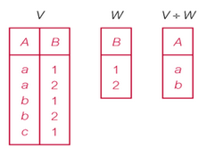
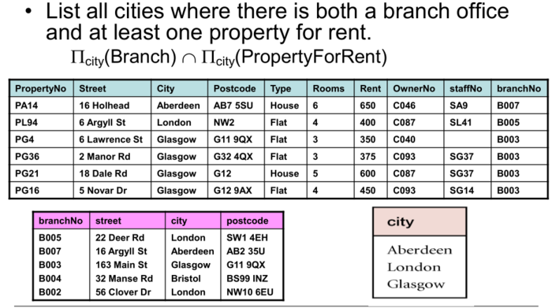

# 关系代数

整理自[wiki](https://zh.wikipedia.org/wiki/%E5%85%B3%E7%B3%BB%E4%BB%A3%E6%95%B0_(%E6%95%B0%E6%8D%AE%E5%BA%93))、其他材料

20180723

jackgo73@outlook.com

**>>>记住分类、标题<<<**

## 原始运算（并、差、笛卡尔、选择、投影）

如同任何代数，一些运算是原始的，而可以通过原始运算来定义的另一些运算是导出的。

六个原始运算是

- “选择”
- “投影”
- 笛卡尔积（也叫做“叉积”或“交叉连接”）
- 并集
- 差集
- （“重命名”）

这六个运算在省略其中任何一个都要损失表达能力的意义上是基本的。已经依据这六个原始运算定义了很多其他运算。其中最重要的是交集、除法和自然连接。事实上ISBL显著的用自然连接替代了笛卡尔积，它是笛卡尔积的退化情况。

### 集合运算

笛卡尔积、并集、差集

### 投影 (π)

投影是写为 {\displaystyle \pi _{a_{1},...,a_{n}}(R)} \pi _{{a_{1},...,a_{n}}}(R)的一元运算，这里的 {\displaystyle a_{1},...,a_{n}} a_{1},...,a_{n}是属性名字的集合。这种投影的结果定义为当所有在 {\displaystyle R} R中的元组被限制为集合 {\displaystyle \{a_{1},...,a_{n}\}} \{a_{1},...,a_{n}\}的时候所获得的集合

### 选择 (σ)

广义选择是写为 {\displaystyle \sigma _{\varphi }(R)} \sigma _{\varphi }(R)的一元运算，这里的 {\displaystyle \varphi } \varphi 是由正常选择中所允许的原子和逻辑算子 {\displaystyle \land } \land （与）、 {\displaystyle \lor } \lor (或)和 {\displaystyle \lnot } \lnot （非）构成的命题公式。这种选择选出 {\displaystyle R} R中使 {\displaystyle \varphi } \varphi 成立的所有元组

### （重命名 (ρ)）

重命名是写为 {\displaystyle \rho _{a/b}(R)} \rho _{{a/b}}(R)的一元运算，这里的结果同一于 {\displaystyle R} R，除了在所有元组中的 {\displaystyle b} b字段被重命名为 {\displaystyle a} a字段之外。它被简单的用来重命名关系的属性或关系自身。

## 派生运算（连接、除法、交集）

### join

#### θ-join

[笛卡尔积+过滤条件](https://blog.csdn.net/wangjianyu0115/article/details/45538633)

#### Natural join

只返回满足连接项的行

#### Outer join

##### 左外连接

Left outer join is join in which tuples from R that do not have matching values in common columns of S are also included in result relation

##### 右外连接

同左外连接类似，右关系全部保留

##### 全外连接

显式所有关系，左连接+右连接

### 除法

- R÷S
- 保留V内与W相同的项，然后显式这个项所对应的值

### 交集

- R∩S
- 留下相同项

