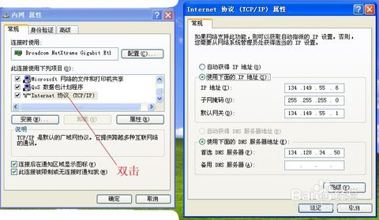

# win多网卡路由

| 网络   | IP           | 子网掩码          | 网关          |
| ---- | ------------ | ------------- | ----------- |
| 外网   | 192.168.1.85 | 255.255.255.0 | 192.168.1.1 |
| 内网   | 192.18.60.19 | 255.255.255.0 | 192.18.60.1 |

# 第一步 内网配置

设置内网网的IP地址，上步奏已确定好内外网的连接，选择内网图标，通过右键-属性，在常规中找到Internet协议（TCP/IP），双击，勾选使用下面的IP地址，将IP地址填写下去。如图所示，也将DNS填写好。



# 第二步 外网配置

设置好内网IP地址后，就可以设置外网的IP地址了。需要注意的是：外网的网关不要填写，直接空在哪里就可以了，不然会造成路由的冲突。其他的设置方法和内网一样。
**注意DNS一定要填**

# 第三步 路由配置

cmd执行

| 命令                                       | 结果                             |
| ---------------------------------------- | ------------------------------ |
| route delete                             | 删除0.0.0.0默认路由                  |
| route add 192.18.0.0 mask 255.255.0.0 192.18.60.1 -p | 增加198.18.x.x段路由到192.168.60.1网关 |
| route add 0.0.0.0 mask 0.0.0.0 192.168.1.1 -p | 增加其他段路由到192.18.1.1网关           |

注意后面的IP要添网关的IP，表示路由到某网关。

| 内网网站部署在192.16.x.x上面，所以要加一句。              |
| ---------------------------------------- |
| route add 192.16.0.0 mask 255.255.0.0 192.18.60.1 -p |

# route help

```
ROUTE [-f] [-p] [-4|-6] command [destination]
                  [MASK netmask]  [gateway] [METRIC metric]  [IF interface]

  -f           清除所有网关项的路由表。如果与某个
               命令结合使用，在运行该命令前，
               应清除路由表。

  -p           与 ADD 命令结合使用时，将路由设置为
               在系统引导期间保持不变。默认情况下，重新启动系统时，
               不保存路由。忽略所有其他命令，
               这始终会影响相应的永久路由。Windows 95
               不支持此选项。

  -4           强制使用 IPv4。

  -6           强制使用 IPv6。

  command      其中之一:
                 PRINT     打印路由
                 ADD       添加路由
                 DELETE    删除路由
                 CHANGE    修改现有路由
  destination  指定主机。
  MASK         指定下一个参数为“网络掩码”值。
  netmask      指定此路由项的子网掩码值。
               如果未指定，其默认设置为 255.255.255.255。
  gateway      指定网关。
  interface    指定路由的接口号码。
  METRIC       指定跃点数，例如目标的成本。

用于目标的所有符号名都可以在网络数据库
文件 NETWORKS 中进行查找。用于网关的符号名称都可以在主机名称
数据库文件 HOSTS 中进行查找。

如果命令为 PRINT 或 DELETE。目标或网关可以为通配符，
(通配符指定为星号“*”)，否则可能会忽略网关参数。

如果 Dest 包含一个 * 或 ?，则会将其视为 Shell 模式，并且只
打印匹配目标路由。“*”匹配任意字符串，
而“?”匹配任意一个字符。示例: 157.*.1、157.*、127.*、*224*。

只有在 PRINT 命令中才允许模式匹配。
诊断信息注释:
    无效的 MASK 产生错误，即当 (DEST & MASK) != DEST 时。
    示例: > route ADD 157.0.0.0 MASK 155.0.0.0 157.55.80.1 IF 1
             路由添加失败: 指定的掩码参数无效。
             (Destination & Mask) != Destination。

示例:

    > route PRINT
    > route PRINT -4
    > route PRINT -6
    > route PRINT 157*          .... 只打印那些匹配  157* 的项

    > route ADD 157.0.0.0 MASK 255.0.0.0  157.55.80.1 METRIC 3 IF 2
             destination^      ^mask      ^gateway     metric^    ^
                                                         Interface^
      如果未给出 IF，它将尝试查找给定网关的最佳
      接口。
    > route ADD 3ffe::/32 3ffe::1

    > route CHANGE 157.0.0.0 MASK 255.0.0.0 157.55.80.5 METRIC 2 IF 2

      CHANGE 只用于修改网关和/或跃点数。

    > route DELETE 157.0.0.0
    > route DELETE 3ffe::/32
```


